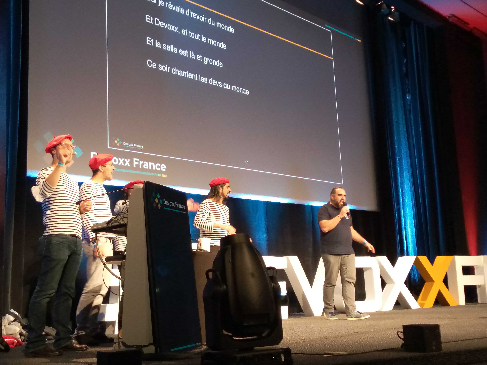
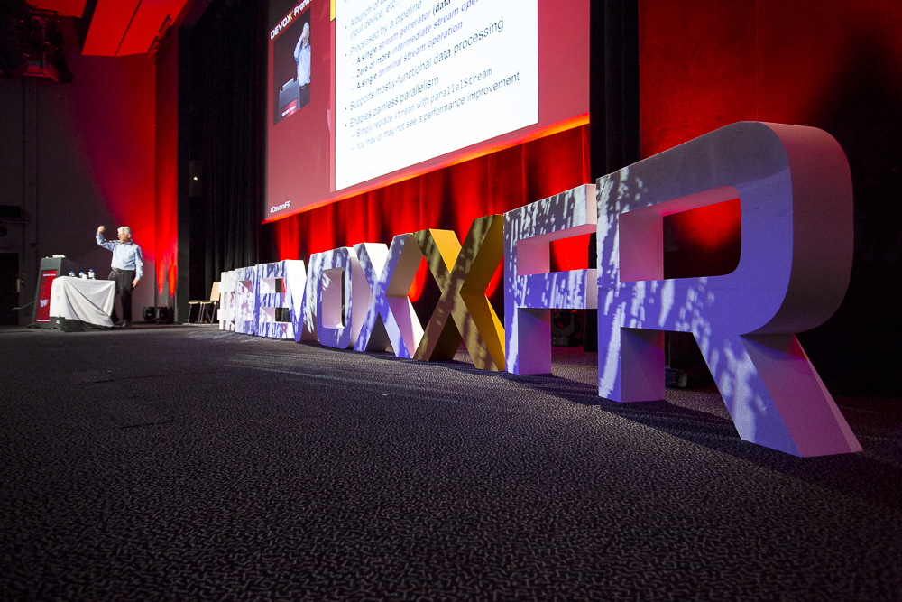

:lang: fr

== Introduction

https://www.devoxx.fr/[Devoxx France] est l’une des conférences les plus attendues des *développeurs passionnés*. Organisée par https://www.societe.com/societe/quantixx-808179899.html[Quantixx] et ayant lieu au Palais des Congrès, à Paris, elle s’est tenue sur trois jours cette année du *29 septembre au 1er octobre 2021*. Elle a accueilli des développeurs et exposants autour d’universités, Tools in Action, Quickies ainsi que des Keynotes.

== Un peu d’histoire derrière ces chiffres 

Cette année c’était plutôt l’édition *spéciale 9 ¾*. En effet, la 9ème édition initialement prévue en avril 2020 n’a pas pu se tenir compte tenu de la crise sanitaire qui a frappé  le monde, et Devoxx n’a pas fait exception : (re)Confinements, couvre-feu, mesures sanitaires, cette édition n’a pas eu lieu. Après plusieurs péripéties et reports de dates, tout le comité n’a pas ménagé d'efforts pour que nous puissions nous rassembler en septembre 2021. Nous avons pu réaliser l’importance de se voir ensemble et de passer 3 jours, avec les orateurs/trices, les exposants et toutes les personnes venues pour participer à ces 3 jours au Palais des Congrès, à Paris. Un grand merci à tous pour ce bel événement malgré toutes les difficultés. 

== Une conférence au format spécial 

En effet sur ces 3 jours, la conférence propose plusieurs formats : 

* Les *Keynotes* ou plénières d’ouverture ont mis cette année en avant comment l’écosystème IT a contribué à gérer la pandémie due au COVID-19.
* Les *Conférences* sont des présentations de 45 minutes.
* Les *Universités* sont des présentations longues de 3 heures.
* Les *Tools In Action* sont des sessions courtes de 30 minutes, destinées à présenter un outil, une pratique logiciel ou une solution.
* Les *Quickies* sont des sessions courtes de 15 minutes, pendant l’heure du déjeuner. C’est le format dédié aux débutants. C’est un format simple et rapide qui permet de découvrir un projet ou une idée pendant l’heure du repas.

== On s’amuse aussi bien à Devoxx icon:fire[]

On a eu aussi droit à un thème cette année avec le titre https://podcast.ausha.co/les-enflures-de-la-tech/revoir-du-monde-devoxx-2021[Revoir du monde (Devoxx 2021)] par *Les enflures de la tech*. C’est une composition inspirée du morceau https://www.youtube.com/watch?v=NrQnuMnL2ac[_"Un autre monde"_] de *Téléphone*. On a eu droit à un spectacle proposé par les Cast Codeurs lors de la clôture. La conférence fut clôturée par un spectacle des *Cast Codeurs*.
.Spectacle des Cast Codeurs
[caption=""]

== Quels types de talks

[red]#Devoxx# est maintenant ouvert à tous les développeurs, devOps, et pas seulement issu du monde Java, même si la majorité des technologies tourne autour de l’écosystème JVM. Cette année, nous avons eu l'occasion de voir des talks qui ne sont pas du tout techniques, une première à Devoxx France. Le comité a tenu à mettre  en évidence et à supporter à sa manière tous les acteurs qui ont contribué à lutter contre cette crise sanitaire en proposant des solutions IT ou pas. On peut citer les keynotes comme link:++https://cfp.devoxx.fr/2021/talk/KXD-3168/Projet_MakAir,_comment_et_pourquoi_construire_un_respirateur_open_source_%3F++[“Projet MakAir, comment et pourquoi construire un respirateur open source ?”], link:++https://cfp.devoxx.fr/2021/talk/VNP-0838/Comment_le_COVID_a_revolutionne_Doctolib++[“Comment le COVID a révolutionné Doctolib”], link:++https://cfp.devoxx.fr/2021/talk/AYK-5495/Pourquoi_l%27OpenData_ne_dispense_pas_de_quelques_notions_de_statistiques.++[“Pourquoi l'OpenData ne dispense pas de quelques notions de statistiques”] qui ont présenté le bien fondé de l’OpenData, sa part dans la crise sanitaire, avec les solutions qui ont vu le jour ainsi que l'importance de l’interprétation des données statistiques : tout le monde dispose des mêmes données mais chacun donne son interprétation (erreurs de présentation, de calcul, d'interprétation qui sont à éviter... ).

== Du Web à la Sécurité, en passant par le Cloud Computing….

****
Sans surprise, les [red]#talks# purement IT étaient également au Rendez-vous.
****

=== Java 17, avec l’université tenue par José PAUMARD et Rémi FORAX 

La nouvelle version  vient de sortir et est une *version LTS* qui succède aux versions 8 et 11. Cette version apporte de nouvelles fonctionnalités tant dans les API que dans le langage lui-même. 

De nouveaux éléments ont été présentés que nous pouvons d’ores et déjà utiliser dans nos applications : 

* les nouvelles méthodes de l'``API Collection`` (des collections immutables) 
* celles de l'``API Stream`` : les méthodes ``toList()``, ``mapMulti()``, l'optimisation de certaines lambdas avec les méthodes ``peek()``, ``skip()``, ``limit()``…, 
* les ``Records`` : un support transparent, peu profond et immuable pour une séquence d'éléments ordonnée spécifique sont des parfaits candidats pour des ``DTO`` par exemple, la possibilité de faire la validation des components, des méthodes factory possible..., 
* les ``Text Blocks``, les ``Sealed Types`` et les constructeurs des types wrapper des types primitifs. 
* Le ``pattern matching``, développé dans le *projet Amber* a commencé à livrer ses premiers éléments : un nouveau ``switch`` et un nouvel ``instanceof`` construit sur le pattern de type. 

=== Du nouveau également du côté de Quarkus

Ce relativement jeune [red]#framework Java# (par rapport à Spring) basé sur Vert.x évolue exponentiellement et apporte de belles fonctionnalités à chaque version. Pour ceux qui ont été séduits et qui utilisent déjà ce framework pour créer des applications rapides et peu gourmandes en mémoire, il vous permet aussi de sécuriser vos applications de façon la plus simple possible. En effet, avec la dernière version de ce framework, il suffit juste d’ajouter l’extension OIDC (OpenID Connect) et le framework démarrer un conteneur docker *Keycloack* avec les configurations nécessaires. Aurais-je omis de vous notifier une nouvelle merveille apportée ? Quarkus est maintenant livré avec une nouvelle interface utilisateur Dev expérimentale (Dev UI) , qui est disponible en mode dev (lorsque vous démarrez quarkus avec ``mvn quarkus:dev``) à ``http://localhost:8080/q/dev`` par défaut.  Sur cette interface, vous trouverez vos configurations et d’autres objets. Vous pourrez même tester vos endpoints (ceci peut permettre de se passer de *swagger-ui*). Revenons un peu sur la sécurité : vous avez maintenant une interface dédiée pour vos config et tests. On a eu une belle présentation en live coding avec *Sebastien BLANC* sur cet aspect.
L’université sur les *Microservices réactifs avec Quarkus* a été très intéressante. Pour ceux qui s'intéressent à la *programmation réactive*, Quarkus unifie la programmation _impérative et réactive_, ce qui vous laisse le choix. Dans cette université, il a été également présenté ce qui se cache derrière _“le réactif”_, l’historique et les tendances actuelles et surtout  comment implémenter des applications réactives avec Quarkus et *Mutiny*, sa nouvelle librairie de programmation réactive. Ils ont couvert ``HTTP`` mais également ``Kafka``, l’accès aux bases de données, les transactions, l’utilisation de services réactifs, les ponts avec la programmation impérative traditionnelle. Cette université a repris tout ce dont vous avez besoin pour commencer vos développements réactifs sur Quarkus.    

=== Côté Cloud

Il y a eu aussi de belles présentations dont celle de *Sébastien STORMACQ* sur les [red]#_Patterns pour des architectures résilientes et hautement disponibles dans le cloud_#. C’était une occasion pour ce blogueur de AWS News Blog de nous présenter des patterns applicables à nos architectures pour obtenir une *résilience* et une *haute disponibilité* quelque soit la plateforme Cloud (AWS, Azure, Google, …). Sébastien a passé en revue les modèles les plus utiles pour la construction de systèmes logiciels résilients comme 

* la *Geo Availability* (disponibilité par zones et scalabilité par zone), 
* le *Decoupling and async Pattern* : les applications construites sur le modèle asynchrone avec des patterns events driven, des callbacks, pull/push, streaming, et les files d'attentes sont tous bien robustes,
* les modèles pour la base de données : database federation, sharding, read/write separation, master and replicas…, 
* le *health checking*, 
* le *load shedding*, 
* le *Timeout backoff and retries*, 
* le *sharding*,
* le *shuffle sharding* 
* et le modèle basé sur le Chaos comme le https://www.gremlin.com/chaos-monkey/[Chaos Monkey] de Netflix

IMPORTANT: Il y avait beaucoup de talks très intéressants dont malheureusement je ne pourrai vous en parler. Mais le comité fait bien les choses. Les talks sont enregistrés et j’espère vous a donné envie, vous aussi, de découvrir ces présentations qui sont très riches en retour d'expérience. Pour voir l’ensemble des talks, vous pourrez les retrouver sur la chaîne https://www.youtube.com/channel/UCsVPQfo5RZErDL41LoWvk0A[YouTube DevoxxFR]. 

NOTE: Si vous voulez découvrir ou aller plus loin dans ces solutions, [red]#Lunatech# propose des formations qui seront adaptées à vos besoins.

== Et l’édition à venir 

.Devoxx France 2022 edition 10 ans à venir
[caption=""]

Si le contexte sanitaire continue à évoluer favorablement, la prochaine édition aura lieu du 20 au 22 avril 2022. Cette édition fêtera les 10 ans de la création de Devoxx France. Le comité d’organisation nous promet déjà d’être heureux de nous recevoir de nouveau 3 jours, pour une édition spéciale 10 ans qui sera riche en surprises.