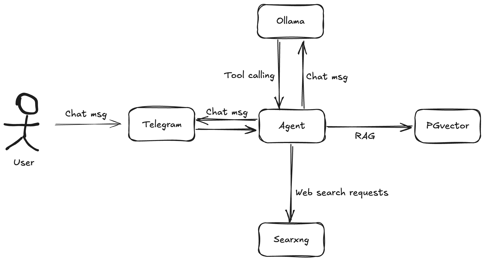
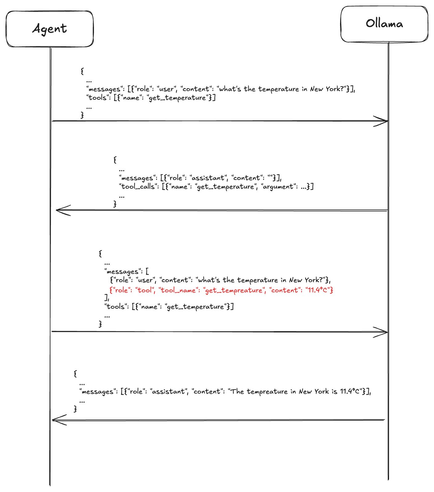
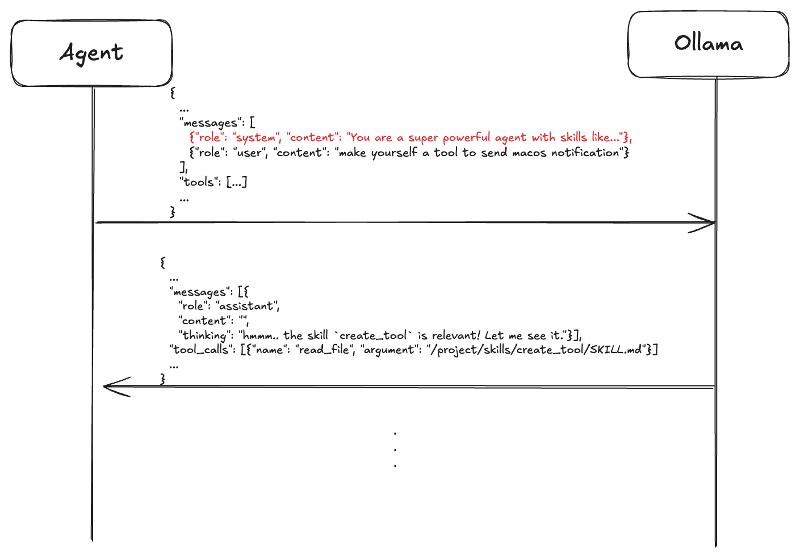
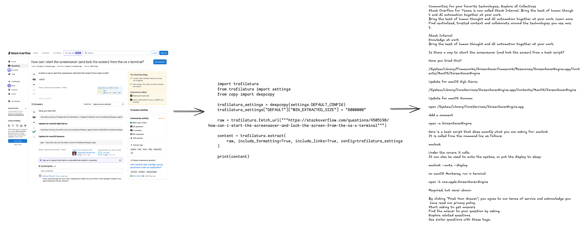

= Ollama is (almost) all you need to build your personal agent
boyuan-xiao-at-work
v1.0, 2026-04-13
:title: Ollama is (almost) all you need to build your personal agent
:lang: en
:tags: [LLM, Python, AI agent, NLP pipeline, PGvector]

== Introduction
As the 10-millionth article about AI agents that you are reading, I focus on how much you can do to make an AI agent as standalone as possible. Therefore, I will show you the personal agent that I built with only Ollama (and a few other open source libraries/software). Since all the components used in this article are available on all platforms, the agent is fully controlled by you - the maker. You get to decide where it should be deployed, you get to decide its capabilities and you have a transparent view of what data the LLM accesses. Most importantly, I want to share the message that AI applications are more accessible than you think — and this project I built over the past few weeks is my proof.

== Straight to the demo
To simplify the work and fully focus on the agent-building part, I chose to use a Telegram bot as the frontend. Note that I've also edited the GIFs to cut out frames where nothing changed on screen. So the actual response time is much longer than what you see in the picture since the demo happened on my Macbook Pro with a M3 Pro chip + 36GB memory. And I used the `qwen3.5:9b` model.

=== Simple tasks
Let's start with some simple tasks like web searching, file reading and utilizing the CLI. They are classified as simple tasks because these only involve tool calling, which I'll explain shortly.

[[agent_reading_file]]
.Telling the agent to read the `requirements.txt` and return the python libraries in there.

[[agent_web_searching]]
.Asking the agent about the election result of Hungary, which was just revealed yesterday.

[[agent_calling_cli]]
.Telling the agent to remove all non-running containers. Achieved via multiple rounds of calling `docker`.

=== Why not let the agent build itself
Without a doubt, a substantial amount of source code of the agent is generated by AI. Especially the LLM tools, which are mostly boilerplate code with some slight changes to do very basic tasks. As I stumbled upon the idea of LLM skills, a natural question followed: why not let the agent build itself?

Therefore, I defined `create_tool` skill with a common `SKILL.md` skill file and a `tool_template.py` template file. Spoiler: it worked.

[[agent_making_tool]]
.At first I asked the agent to send me a macos notification without using any shell commands (otherwise it would be as simple as just one `osscript` command) and it couldn't. Then I asked it to create such tool to do so. As you can see in the end, a notification was indeed sent.

=== Browser automation
Browser automation is essential to make a personal agent more powerful since a large proportion of daily workflow (at least of mine) happens in the browser. Now that the agent is equipped with the skill to create tools for itself, I asked it to build one to control the chrome browser via Playwright. Controlling the browser is obviously much more complicated than just sending macos notifications. In the end, the tool was mostly functional from the start, though I had to manually fix a few bugs.

[[agent_controlling_browser]]
.The first prompt tells the agent to open the browser and the second tells it to search "lunatech" in Google. Sadly some human intervention is still needed for the cookie banner and the "are you a human" check.

== Under the hood
=== Tools and skills
The architecture of the agent is fairly simple. It consists of the python application, Ollama, a https://github.com/pgvector/pgvector[PGvector] container and a https://github.com/searxng/searxng[Searxng] container for web search. The communication between the python application and Ollama is nothing more than REST API calls, you can refer to their https://docs.ollama.com/api/introduction[comprehensive documentation] for that.

[[architecture]]
.The architecture, with the agent being the python application.

Raw POST requests to Ollama alone don't give the agent any real-world awareness. It doesn't know the current time, has no idea about my location, let alone search on the internet. However, it's quite easy to mitigate this by defining tools to enable the LLM to interact with the real world.

https://docs.ollama.com/capabilities/tool-calling[Ollama] and some other popular AI services like https://developers.openai.com/api/docs/guides/function-calling[OpenAI] and https://platform.claude.com/docs/en/agents-and-tools/tool-use/programmatic-tool-calling[Anthropic] provide tool calling functionality in a similar way. All you need is to include your tool definition in the `POST` request — the LLM handles the rest. When and which tool to invoke is purely dependent on what's in the LLM's response. 

[source,bash]
----
curl -s http://localhost:11434/api/chat -H "Content-Type: application/json" -d '{
  "model": "qwen3.5:9b",
  "messages": [{"role": "user", "content": "What is the temperature in New York?"}],
  "stream": false,
  "tools": [
    {
      "type": "function",
      "function": {
        "name": "get_temperature",
        "description": "Get the current temperature for a city",
        "parameters": {
          "type": "object",
          "required": ["city"],
          "properties": {
            "city": {"type": "string", "description": "The name of the city"}
          }
        }
      }
    }
  ]
}'

# Response:
# {
#	"model":"qwen3.5:9b",
#	"created_at":"2026-04-14T11:49:16.928037Z",
#	"message": {
#		"role":"assistant",
#		"content":"",
#		"thinking":"The user is asking for the temperature in New York. Blablabla...",
#		"tool_calls": [{                <-- this!
#			"id":"call_c7k6jylw",
#			"function": {
#				"index":0,
#				"name":"get_temperature",
#				"arguments": {"city":"New York"}
#			}
#		}]
#	},
#	"done":true,
#	"done_reason":"stop",
#	...
#}
----

And to return the tool calling result to the LLM, you only need to append the result to the message list and `POST` it to Ollama again. So the complete flow will be like the following:

[[chat_flow]]
.The tool calling result is marked red in the picture and it's passed to the LLM with "tool" role.

With that, the tool-calling loop is complete — but tools alone aren't enough for complex tasks. What do skills do? Think about a complex task like creating an LLM tool for the agent. It will involve orchestrating multiple tools to achieve the best result. Beyond that, file format, location, and naming conventions all need to be clearly defined for the LLM to follow. Therefore, this is where skills shine. A skill usually only consists of a markdown file containing the recipe of how to tackle certain tasks. For example, my `SKILL.md` for the create LLM tool skill can be summarized as follows:

1. Search the web for the possible solution first.
2. Read the `tool_template.py` file in the skill folder to know how to properly create a tool.
3. Write the tool file to `src/modules/ai/tools`. The file name should be the same as the tool name.
4. Add external requirements to `requirements.txt` and inform the user if there are any; otherwise, call `reload_tools_and_skills` tool to reload.

=== Plus prompt engineering
You might be wondering: "Wait, how do we feed skills to the agent?". Indeed, there's no entrypoint in the API payload where you can easily supply the skills to the LLM like tools.

As a result, we need to literally tell the LLM that you have those skills. And the system prompt is the perfect spot. According to Ollama's documentation, some behavioral instructions can be supplied to hint the LLM about how to generate ideal responses by inserting a message with the role of `system` in the dialogue. In there, we can compose a paragraph saying "you have the following skills, where they are located, and what each one does.". Thus, the message flow between the agent and the LLM would be like the following:

[[chat_with_skill]]
.Literally telling the LLM that you have skills!

Besides the skills, we can also put some brief but useful information into the system prompt to speed up the response generation. For example, the current time with time zone, the city you live in and the underlying OS the agent runs on. Since they add trivial token overhead, we can naturally include them up-front so that LLMs don't have to ask the agent for them through tool calling.

== Fighting the context window limitation
Tools and skills are well-established concepts, but making them work well under tight resource constraints is where the real challenge lies. Running LLMs locally on a laptop amplifies these constraints significantly. Small context window is the most prominent one. The smaller the context window is, the sooner the LLM starts forgetting the earlier parts of the conversation. On top of that, sometimes a single message to the LLM can trigger a long chain of tool calls, which stresses the context window even more.

Fortunately, Python's AI ecosystem makes mitigation fairly straightforward. Here are the approaches I took.

=== Efficient web search
At first, we can start with the web search tool as web pages usually contain so much irrelevant information. Take Stackoverflow as an example, OP's problem and the other people's replies are all we want the LLM to know. Obviously, including the navigator on the left part of the page or the linked posts on the right would be a huge waste of tokens. Luckily, there is an existing library specifically for this job — https://github.com/adbar/trafilatura[trafilatura].

[[trafilatura]]
.Simple code, simple results.

With the help of trafilatura, only a few lines of code are needed to extract the most relevant information from a web page.

=== Similarity score vs rerank score
Ideally we wish the LLM to remember all the skills we provide and all the messages in the conversation. It won't be a problem at the beginning when there are only a few skills and a few dozens of messages. But it's worth planning ahead. We need to be smart and selectively include relevant skills and information when the total amount of them is beyond control. This is the moment we need to consider RAG.

RAG is a technique we can't avoid when discussing AI agents. The foundation of RAG is semantic search. It enables us to accurately search for relevant information to enhance LLM response generation. Compared to old-school lexical search, semantic search focuses on semantic relevancy instead of lexicographical similarity.

The most common way to conduct semantic search is to generate embeddings — high-dimensional vectors — and compare their cosine similarity. Think about the skills once again, when users send a message like "How can I make a tool for car fixing?", `create_tool` would clearly be irrelevant here. Each skill has a short description, and I use its embedding to decide whether it's relevant enough to include in the system prompt.

[source,python]
----
from sentence_transformers import SentenceTransformer

skill_description = "This is the guide for creating high-quality agent tools that enable LLMs to interact with external services."

model = SentenceTransformer("all-MiniLM-L6-v2", local_files_only=True)

similarity1 = model.similarity(
    model.encode("How can I make a tool for car fixing?"),
    model.encode(skill_description)
)
print(similarity1.item())
# 0.20860469341278076

similarity2 = model.similarity(
    model.encode("Make yourself a tool for browser automation."),
    model.encode(skill_description)
)
print(similarity2.item())
# 0.3079521059989929
----

Although the similarity score is better when a user asks "Make yourself a tool for browser automation." than to "How can I make a tool for car fixing?", the score difference is not significant enough. That makes it difficult to set a score threshold so that we can eliminate the noise. However, when working with `sentence-transformers`, there are always surprises. It provides a Cross Encoder to achieve higher accuracy prediction.

Unlike a standard embedding model that encodes each sentence independently, a Cross Encoder takes two sentences simultaneously as input and outputs a relevance score directly. There is no embedding or cosine similarity involved — the model reads both texts together and reasons about their relationship as a whole. This makes it significantly more accurate than similarity-based ranking, at the cost of being slower since you cannot pre-compute and cache the vectors upfront. For skill selection, where precision matters more than speed, it is the right trade-off.

[source,python]
----
from sentence_transformers import CrossEncoder

skill_description = "This is the guide for creating high-quality agent tools that enable LLMs to interact with external services."

model = CrossEncoder("BAAI/bge-reranker-base", local_files_only=True)
to_predict = [
    (skill_description, "How can I make a tool for car fixing?"),
    (skill_description, "Make yourself a tool for browser automation."),
]

scores = model.predict(to_predict)
print(scores)
# [0.01137436 0.24178135]
----

Now let's look back on the previous section and push the web search efficiency to its limit. As depicted in <<trafilatura, Figure 9>>, there is still quite a lot of garbage text in the trafilatura extraction result. The approach is to first split the text into several text chunks, then exclude low-scoring chunks and return the remaining chunks reranked by a Cross Encoder.

[source,python]
----
import trafilatura
from trafilatura import settings
from copy import deepcopy
from sentence_transformers import CrossEncoder, SentenceTransformer
from typing import List

similarity_model = SentenceTransformer("all-MiniLM-L6-v2", local_files_only=True)
rerank_model = CrossEncoder("BAAI/bge-reranker-base", local_files_only=True)

def rank(message: str, passages: List[str]) -> List[float]:
    to_predict = [(message, passage) for passage in passages]
    scores = rerank_model.predict(to_predict)
    return scores

def compare_similarity(str1: str, str2: str) -> List[float]:
    similarity = similarity_model.similarity(similarity_model.encode(str1), similarity_model.encode(str2))
    return similarity.item()

def text_chunking(text: str, chunk_size: int = 50) -> List[str]:
    words = text.split()
    return [
        " ".join(words[i : i + chunk_size])
        for i in range(0, len(words), chunk_size)
    ]

user_query = "original query"

trafilatura_settings = deepcopy(settings.DEFAULT_CONFIG)
trafilatura_settings["DEFAULT"]["MIN_EXTRACTED_SIZE"] = "8000000"

raw = trafilatura.fetch_url("some url")
content = trafilatura.extract(
    raw, include_formatting=True, include_links=True, config=trafilatura_settings
)

chunks = text_chunking(content)
similarity_scores = [compare_similarity(user_query, c) for c in chunks]
new_chunks = [c for score, c in sorted(zip(similarity_scores, chunks), reverse=True)][:3]  # only keep the first 3 chunks

rank_scores = rank(user_query, new_chunks)
return "\n\n".join(
    [row for score, row in sorted(zip(rank_scores, new_chunks), reverse=True)]
)
----

This two-stage pipeline — filtering by embedding similarity, then reranking with a Cross Encoder — is a common pattern in production RAG systems, balancing speed and accuracy.

== Takeaways
Before I started working on this project, the idea that AI applications are basically about prompt engineering was still stuck in my head. Building this agent was a reminder that there is far more — and that RAG, in particular, is genuinely fun once you get your hands dirty. For a long time, I had heard the same concepts repeated over and over: embeddings, context windows, reranking, tool calling. I understood them in theory, but they only truly clicked when I started building. If there is one thing I hope you take away from this post, it is that AI applications are not as intimidating as they seem. The building blocks are approachable, the tools are mature, and the best way to learn is to just start writing. Pick a small idea, build it, and the concepts will follow.
